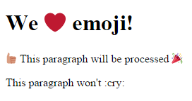

# Deprecation notice

Yeah, this was an interesting project at the time, but browser emoji support has progressed faster than I've been able to maintain this repo. I'm not maintaining this repo right now. But who knows, maybe I'll pick it up again sometime.

# Imojify
Front-end library that replaces colon :emoji: with images

## Introduction
This is a front-end library that replaces text inside colons with an SVG image of its corresponding emoji. This means the output will look the same on all modern browsers (since unicode characters don't play nicely with Windows). It is also possible to add your own custom emoji to your site.

To find the right colon emoji to use, try [emoji.muan.co](http://emoji.muan.co/). The images themselves were lovingly borrowed from [Twitter's Twemoji repository](https://github.com/twitter/twemoji) and the emoji map file is from the [Emoji One project](https://github.com/Ranks/emojione).

e.g. `:smile:` becomes 

The emoji scales to the size of the font, so emoji specified in `<h1>` tags will be larger than those in `<p>` tags.

## What's new in v0.0.5
- Replaced Gemoji with Twemoji
- Renamed project from Gemojify to Imojify. All functions and class names have been renamed to reflect this
- Added ignore selector to prevent applying `imojify()` inside certain elements
- Created spans have `title` and `aria-label` attributes for accessibility
- Custom emoji must be placed in the images/emoji/custom folder, like `upside_down_face.svg`
- Use `npm run build` instead of `gulp build` in instructions
- Performance improvements

## Use in your project

Using NPM or Bower?

```
npm install imojify
bower install imojify
```

Or just download the repository from GitHub.

Copy the contents of the `css`, `images` and `js` directories into your project.

Inside your HTML, include a reference to `css/imojify.css` and `js/imojify.js`. Add an extra `<script>` tag that calls `imojify()`. If you use that function with no parameters, `imojify()` will process any HTML tags with the class `imojify`. Alternatively you can pass your own selector to the function e.g. `imojify('h1')` to process all `<h1>` tags, or `imojify('#that-element')` to process the element with id `that-element`.

```html
<!DOCTYPE html>
<html>
  <head>
    <link rel="stylesheet" href="css/imojify.css">
  </head>
  <body>
    <h1 class="imojify">We :heart: emoji!</h1>
    <p class="imojify">:thumbsup: This paragraph will be processed :tada:</p>
    <p>This paragraph won't :cry:</p>
    <script src="js/imojify.js"></script>
    <script>
      imojify(); // equivalent to imojify('.imojify')
    </script>
  </body>
</html>
```

becomes



## Ignoring elements

If you have some elements within your source element that you don't want processed you can specify a selector to match all elements to ignore.

```js
imojify('.imojify', { ignore: '.ignore-emoji' });
```

## Adding custom emoji

If you're one of those people who thinks "There is no such thing as too much emoji", you can add your own emoji, including animated GIFs!

1. You need to install the development dependencies: `npm install`
1. Add more images to the `images/emojis/custom` folder, making sure their filenames without extensions don't clash*.
1. Run `npm run build`. As if by magic, `imojify.css` should have been updated with your new images!
1. You can now use colon emoji by referencing the filename. For example, `demo.html` references `:upside_down_face:` which is replaced by `upside_down_face.svg` from the `custom` folder. Note that if you include a file with the same name as a predefined emoji, the predefined emoji will be replaced.

If you don't want to use node, you could also modify the CSS file manually.

*`smile.png` clashes with `smile.gif` (they would both be applied to the `emoji-smile` class)

## License
Graphics (in `images/emoji` folder): Copyright 2014 Twitter, Inc and other contributors, licensed under [CC-BY 4.0](https://creativecommons.org/licenses/by/4.0/)

`emojimap.json` is a modified version of [Emoji One](https://github.com/Ranks/emojione)'s `emojis.json`, MIT licensed

Everything else is either coded by me or my [awesome contributors](https://github.com/danielthepope/imojify/graphs/contributors), also MIT licensed.
